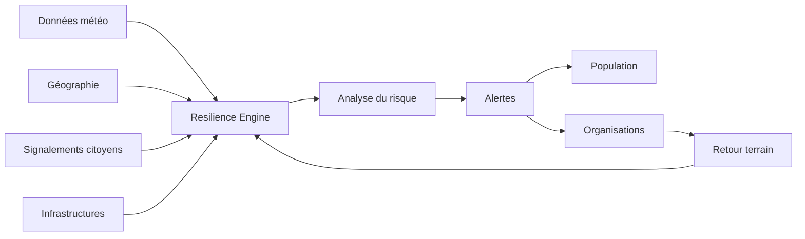

# HashCode Resilience

> Plateforme de résilience numérique pour anticiper les risques, alerter les communautés et coordonner l'action face aux catastrophes.

**Domaine:** Web & Software Engineering · **Programme:** HashCode Global Impact · **Statut:** Research / MVP discovery

## Problème
Inondations, sécheresses, feux, événements météorologiques et ruptures d'infrastructures peuvent toucher rapidement des populations vulnérables. L'information utile est souvent dispersée ou arrive trop tard.

## Vision
Transformer des données hétérogènes en alertes compréhensibles et actionnables, avec une forte attention aux zones à faible connectivité.

## Cartographie

## MVP
Carte des risques, signalements, règles d'alerte, notifications SMS/web, historique et tableau de bord opérationnel.

## Impact
Délai détection→alerte, population couverte, taux de réception, précision et temps de coordination.

## Contribuer
Voir : https://github.com/HashCode-Reboot/hashcode-contributors

**Doctrine HashCode:** *Build for Africa. Scale for Humanity.*