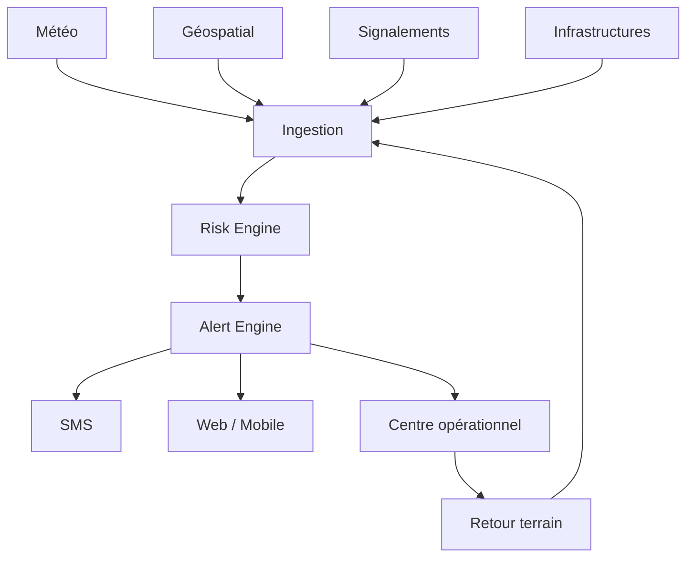

# Architecture — Resilience

## Principes

Sources versionnées, provenance obligatoire, séparation observation/prédiction, seuils d'alerte explicites, résilience des canaux et fonctionnement en faible connectivité.

Les alertes doivent communiquer l'incertitude et éviter de créer une fausse impression de précision.